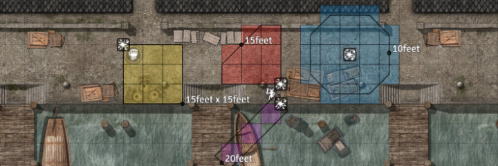
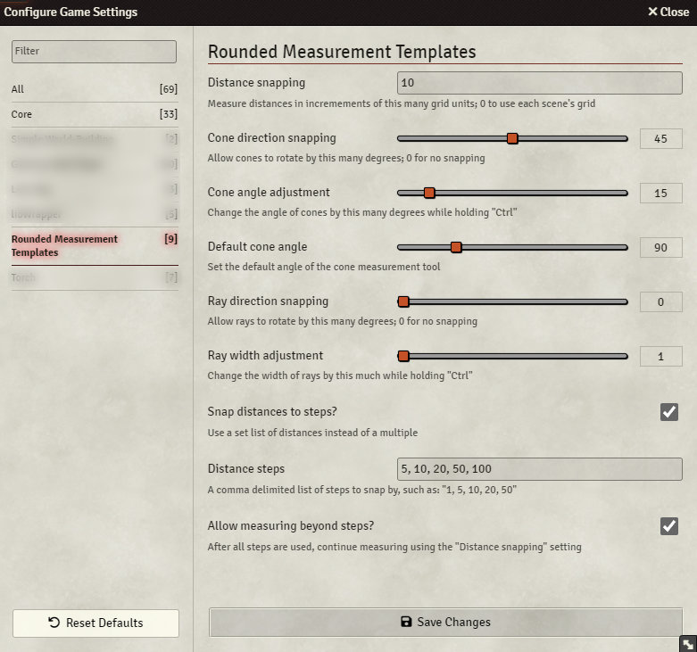
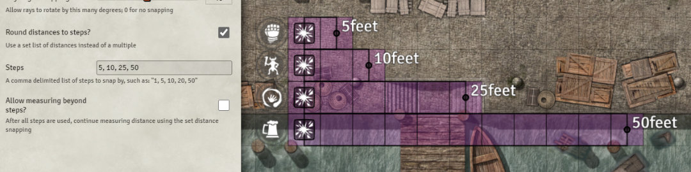

# Rounded Measurement Templates

Round Foundry VTT measurement templates to the nearest size or angle.

## About

This module continues the work of two previous developers for Foundry v12+.

* Forked from the archived [FVTT Rounded Distance for Measured Templates](https://github.com/cdverrett94/FVTT-rounded-distance-for-measured-templates).
* Default cone angle inspired by the abandoned [Cone Measurement Angle](https://github.com/thre-z/cone-measurement-angle) module.

## Usage

When enabled this module will automatically apply default snapping settings to Foundry's measurement templates.

Hold the "Shift" key while measuring to disable snapping.

Hold the "Ctrl" key while measuring to change the angle of cones or the width of rays.

Release the "Ctrl" key to return to snapping distances.

## Settings

You can customise the behaviour of the snapping from the Foundry "Configure Settings" window.

### Distance snapping

Set the interval which measurements will be snapped to.

Setting this field to 0 will use the current scene's grid spacing.

For example, a snapping value of 5 will snap measurement distances to: 5, 10, 15, 20...

### Cones

Use the "Cone direction snapping" setting to change the interval cones rotate by.

Setting this field to 0 will disable snapping.

For example, a snapping value of 15 will snap the direction of cones to: 15°, 30°, 45°...

Use the "Cone angle adjustment" setting to control how the cone angle changes while holding the "Ctrl" key.

Use the "Default cone angle" setting to override the default angle of cones.

This overrides Foundry's default value of ~53°.

### Rays

Use the "Ray direction snapping" setting to change the interval rays rotate by.

Setting this field to 0 will disable snapping.

For example, a snapping value of 15 will snap the direction of rays to: 15°, 30°, 45°...

Use the "Ray width adjustment" setting to control how the ray width changes while holding the "Ctrl" key.

### Steps

If you have irregular intervals which distances need to snap to, you can set a custom list instead.

This can be enabled by checking the "Round distances to steps?" setting.

You can then provide a list of intervals to snap to in a comma delimited.

For example, a "Distance steps" setting of "5, 10, 20, 50, 75" will cause the measurement template to snap to those distances.

The distance of a template will be capped at the last value in the list unless the "Allow measuring beyond steps?" setting is enabled, at which point it will continue snapping based on the "Distance snapping" setting.

## Issues

This module may not work with game systems or addons which already implement their own measurement templates.

If you encounter any problems, raise a ticket on Github and I'll take a look.
